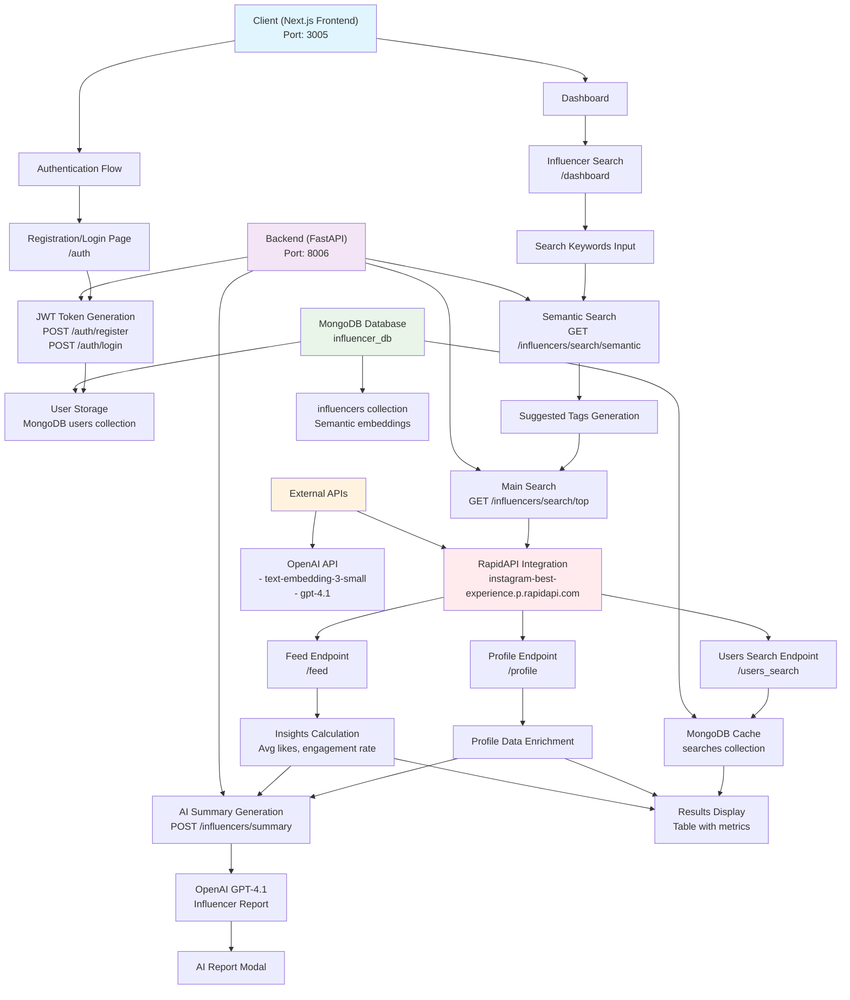

# Insta_influencer_scrap

Lightweight FastAPI backend for collecting and analyzing Instagram influencers using RapidAPI and OpenAI. This project provides collector endpoints (search/profile/insights), influencer report generation via GPT, and a caching layer backed by MongoDB. It also includes utilities for adding semantic (AI-powered) search using OpenAI embeddings.

This README covers:
- Quick start
- Environment variables
- How the backend works (high-level)
- Key endpoints
- Adding AI-powered semantic search (design + steps)
- Troubleshooting

---

Quick start
---------

1. Create a Python venv and install dependencies (example):

```bash
python -m venv .venv
source .venv/bin/activate
pip install -r requirements.txt
```

2. Add environment variables (see below) in a `.env` file.

3. Run the app:

```bash
uvicorn server.main:app --reload --host 0.0.0.0 --port 8000
```

Environment variables
---------------------
- `MONGO_URI` — MongoDB connection string (optional; searches cached if provided)
- `RAPIDAPI_KEY` — RapidAPI key for `instagram-best-experience.p.rapidapi.com`
- `OPENAI_KEY` — OpenAI API key (used for embeddings and GPT)
- `SECRET_KEY` — JWT secret for auth (default in code: `secret`)
- `FRONTEND_URL` — allowed origin for CORS

Place these in a `.env` file at project root, for example:

```env
MONGO_URI=mongodb://localhost:27017
RAPIDAPI_KEY=your_rapidapi_key
OPENAI_KEY=your_openai_key
SECRET_KEY=supersecret
FRONTEND_URL=http://localhost:3000
```

How the backend works (high-level)
---------------------------------

- `server/main.py` initializes the FastAPI app, CORS, JWT auth, and includes routers from `server/influencers.py` and `server/auth.py`.
- `server/db.py` connects to MongoDB and exposes `users_collection` and `searches_collection`. When `MONGO_URI` is missing, caching is disabled.
- `server/influencers.py` exposes collector endpoints:
  - `/influencers/search/top` — queries RapidAPI for username search, enriches with `/profile` and `/insights`, caches results in Mongo `searches` collection.
  - `/influencers/profile` — fetches a single profile via RapidAPI `/profile`.
  - `/influencers/insights` — fetches a user's recent feed and computes avg likes / engagement / engagement rate.
  - `/influencers/summary` — uses OpenAI chat completion (`gpt-4.1`) to generate a human-friendly influencer report.
  - `/influencers/fetch_rapid_followers` — frontend helper to fetch profile data.

Key implementation details:
- RapidAPI calls have best-effort fallbacks to Mongo cache when the API fails.
- A helper `get_embedding(text)` exists in `server/influencers.py` and calls OpenAI embeddings API (`text-embedding-3-small`).

Flow Diagram of code



Key endpoints
-------------

- `POST /auth/token` — (in `server/auth.py`) obtain JWT token
- `GET /me` — returns current authenticated user's email/username
- `GET /influencers/search/top?keyword=...&limit=10` — search usernames via RapidAPI and cached results
- `GET /influencers/profile?user_id=...` — fetch profile details
- `GET /influencers/insights?user_id=...` — fetch aggregated feed metrics
- `POST /influencers/summary` — generate GPT-based influencer report

Adding AI-powered semantic search
--------------------------------

Goal: replace (or augment) plain keyword matching with semantic vector search so queries like "food influencer in Hyd" return relevant influencers even when exact keywords aren't in their bios.

Design (recommended):

A) Data collection layer
- Use existing collector endpoints (`/influencers/search/top`, `/influencers/profile`, `/influencers/insights`) to build a local influencers collection.
- Persist one document per influencer with fields such as: `username`, `bio`, `category`, `location`, `hashtags`, `followers`, `engagement`, plus `embedding` (vector) when available.

B) AI enrichment layer
- For each influencer, compute an embedding from `bio + username + category` using OpenAI `text-embedding-3-small`.
- Store the embedding in the influencer document (e.g., `influencers` collection) or in a dedicated `influencer_embeddings` collection with a reference id.
- Example document shape:

```json
{
  "_id": "12345",
  "username": "the_foodigram",
  "bio": "Hyderabad-based food blogger. Biryani & street food lover.",
  "followers": 45000,
  "engagement_rate": 3.5,
  "embedding": [0.0012, -0.0034, ...]
}
```

C) Search layer (vector search)
- Convert the user query to an embedding using `get_embedding(query)`.
- Compute cosine similarity between the query vector and all influencer embeddings. Using numpy:

```python
import numpy as np

def cosine_similarity(a: np.ndarray, b: np.ndarray) -> float:
    if np.linalg.norm(a) == 0 or np.linalg.norm(b) == 0:
        return 0.0
    return float(np.dot(a, b) / (np.linalg.norm(a) * np.linalg.norm(b)))

# Example: load all embeddings from Mongo and compute top-k
```

- For production-scale data, use a vector DB (Pinecone, Milvus, Weaviate) or MongoDB Atlas vector search to avoid O(N) scans.

D) Bonus: AI query expansion
- Run the original user query through GPT to expand abbreviations and suggest related keywords (e.g. "Hyd" → ["Hyderabad", "Hyd", "Telangana"]).
- Strategy: Use both expanded keyword filtering (fast) and embedding search (semantic). Merge and rank results by a score that combines embedding similarity and keyword match counts.

E) Example search flow
- User: "food influencer in Hyd"
  1. Call GPT to expand query into tokens (optional).
  2. Create embedding for the original query (and optionally for expanded tokens combined).
  3. Run vector search against stored influencer embeddings to retrieve top matches.
  4. Optionally filter/boost results that match expanded keywords (location, tags).
  5. Enrich results with live RapidAPI data if freshness is required and return top influencers with metrics and a short AI-generated summary.

Implementation notes & tips
-------------------------
- Use the existing `get_embedding(text)` helper in `server/influencers.py` to generate embeddings. It calls OpenAI and returns `data[0].embedding`.
- Embedding size and type: `text-embedding-3-small` returns a float vector; store as an array of floats in Mongo. For faster queries, store as a binary vector or use a vector DB.
- If you keep embeddings in Mongo, consider precomputing an L2-normalized version of the vector to make cosine similarity cheap.
- For periodic enrichment: create a background job / script that crawls your saved influencers, generates embeddings, and updates their documents.

Sample enrichment script (pseudo):

```python
from server.influencers import get_embedding
from server.db import db

def enrich_all_influencers():
    influencers = db["influencers"].find({})
    for inf in influencers:
        text = "".join(filter(None, [inf.get('username',''), inf.get('bio',''), inf.get('category','')]))
        emb = get_embedding(text)
        db["influencers"].update_one({"_id": inf["_id"]}, {"$set": {"embedding": emb}})
```

Where to add code in this repo
------------------------------
- `server/influencers.py` already contains `get_embedding`. Add endpoints or helper functions here to:
  - Run enrichment for a single influencer or batch.
  - Run a semantic search endpoint that accepts a query, generates an embedding, and returns top-k matches.
- `server/db.py` defines Mongo collections; add an `influencers` collection if you persist influencers locally.

Security & cost considerations
-----------------------------
- OpenAI embeddings cost per request; batch and cache embeddings to minimize repeated calls.
- RapidAPI calls are rate-limited — cache responses and use asynchronous backoff for production.
- Protect `OPENAI_KEY` and `RAPIDAPI_KEY` — do not commit them to source control.

Troubleshooting
---------------
- If Mongo isn't configured, the app will run but caching is disabled. Ensure `MONGO_URI` is set.
- RapidAPI may return different response shapes; the code includes defensive parsing for `items`, `media`, or `data`.

Further improvements
--------------------
- Replace in-process O(N) vector scan with a vector database (Pinecone, Milvus). This improves latency and enables approximate nearest neighbor search for large datasets.
- Add a background worker (Celery, RQ) to refresh embeddings and RapidAPI enrichments regularly.
- Add tests for the enrichment & search pipelines.

---

For a developer-facing architecture overview see `BACKEND_FLOW.txt` in project root for a concise description of request flows and integrations.

If you'd like, I can implement the semantic search endpoints and an enrichment script next — tell me whether you prefer Mongo-based vector search or integrating a dedicated vector DB.

# Insta_influencer_scrap
# Insta_influencer_scrap
‣慮敲桳楟普畬湥散彲慭歲瑥湩੧


